# CSCE 435 Group project


## 0. Group number: 23


## 1. Group members:
1. Jeffrey Mitchell
2. Ren Mai
3. Brandon Cisneros
4. Christiana Vancura


## 2. Project topic (e.g., parallel sorting algorithms)
This project seeks to both implement and evaluate the similarities and differences between different parallel sorting algorithms with regards to problem size, problem type, and behavior regarding both strong and weak scaling. The parallel sorting algorithms chosen for the scope of this project include the following: bitonic, sample, merge, and radix sort.


### 2a. Brief project description (what algorithms will you be comparing and on what architectures)

#### Bitonic Sort:
Bitonic sort assumes an input size that is a power of 2. This algorithm uses many different processors as a network of comparators in order to sort a sequence. This algorithm must first ensure that data is in a bitonic sequence before sorting. A sequence of numbers is bitonic if it consists of a first substring of strictly non-decreasing numbers, followed by a substring of strictly non-increasing numbers. Once a bitonic sequence is generated, the algorithm can then merge the sequence into a fully sorted list. This can be repeated at scale to sort large sequences. To implement this sorting algorithm, we will be using the MPI architecture.

#### Sample Sort:
Sample sort does not assume any input size, but will split the input into p (the number of processors) buckets. Thus it will be easier to use inputs of size powers of 2. The algorithm splits the initial input into p sections, sorts them using quicksort, and samples s elements from each. These samples are then sorted (again using quicksort), and p-1 elements are chosen as splitters. Each processor splits its input bucket based on the splitters and sends the resultant buckets to the corresponding processor (bucket 0 to 0, 1 to 1, and so on). The total input is thus split into p buckets, which are sorted using bucket sort by each processor. These are then combined to return a sorted list. We will be using MPI architecture to implement sample sort.

#### Merge Sort:
Merge sort works by repeatedly merging larger and larger sorted subsets of an array.
It is not confined to particular input array sizes, and as a comparison-based sorting algorithm,
it can operate on any comparable data type. Merge sort is a divide and conquer algorithm.
In its base case, a subarray of length 0 or 1 is already sorted, and at each step, merge sort
merges two sorted arrays by stepping through them and popping the smallest remaining element from
either. In a parallel environment, each of the `p` nodes will sort itself normally, then will
cooperate to continue the merges across process boundaries, until the array is fully sorted.
For the first layer, odd and even processes will merge with each other, with the odd processes
taking the higher halfs of each pair's array elements. The processes will then sort themselves
into sets of four and use three 2-way merges to generate consistency among the four processors.
The number of processes per group will continue doubling until the full composite array is sorted.
Our implementation will use the MPI architecture.

#### Radix Sort:
Radix sort assumes that the input elements of the problem statement are k digit numbers. The algorithm sorts the elements through means of buckets; by sorting elements by their digits, Radix Sort is able to linearly sort elements as it sorts from least to most significant digit. For the sake of this sorting algorithm, we will be using the MPI architecture.


### 2b. Pseudocode for each parallel algorithm
- For MPI programs, include MPI calls you will use to coordinate between processes

#### Bitonic Sort:
##### MPI calls used to coordinate between processes:
- `MPI_Init(...)`
- `MPI_Comm_rank(...)`
- `MPI_Comm_size(...)`
- `MPI_Send(...)`
- `MPI_Recv(...)`
- `MPI_Comm_split(...)`
- `MPI_Gather(...)`
- `MPI_Scatter(...)`
- `MPI_Finalize(...)`
- `MPI_Barrier(...)`
##### Pseudocode
```C
if worker process:
    receive subarray

    # Make own subarray bitonic sequence
    for each 2-element pair in subarray:
        if odd count pair:
            sort ascending
        if even count pair:
            sort descending
    for each 4-element pair in subarray:
        if odd count pair:
            sort ascending
        if even count pair:
            sort descending
    etc. until subarray is bitonic

    # Multi-step bitonic merge
    for each compare-swap level needed (1 - log2(# of processes)):
        find partner process
        exchange data with partner (MPI_sendrecv)
        if "inferior" partner:
            keep smaller half of data
        else if "superior" partner:
            keep larger half of data

    Send sorted subarray to master

else if master process:
    send subarrays to worker processes (MPI_Scatter)
    receieve sorted subarrays/gather them (MPI_Gather)
    merge sorted subarrays
    return sorted list
```

#### Sample Sort:
##### MPI calls used to coordinate between processes:
- `MPI_Init(...)`
- `MPI_Comm_rank(...)`
- `MPI_Comm_size(...)`
- `MPI_Send(...)`
- `MPI_Recv(...)`
- `MPI_Comm_split(...)`
- `MPI_Gather(...)`
- `MPI_Scatter(...)`
- `MPI_Allgather(...)`
- `MPI_Finalize(...)`
- `MPI_Barrier(...)`
##### Pseudocode
```C
split initial array into subarrays
for each process
    sort each subarray using quicksort
    send process 0 `s` elements (MPI_Send)
barrier (MPI_Barrier)
process 0 receives `s` elements (MPI_Gather)
process 0 sorts elements with quicksort
process 0 chooses `p-1` splitters
process 0 sends splitters to all processes (MPI_Scatter)
for each process
    receive splitters (MPI_Receive)
    from each subarray split on splitters into `p` buckets
    send bucket 0 to process 0, bucket 1 to process 1, ... , bucket `p-1` to process `p-1` (MPI_Scatter)
    barrier (MPI_Barrier)
    processes receive buckets (MPI_Allgather)
    bucket sort received buckets
    send received buckets to process 0 (MPI_Send)
process 0 receives and concatenates buckets (MPI_Gather) 
process 0 returns sorted bucket 0, bucket 1, ..., bucket `p-1`

```

#### Merge Sort:
##### MPI calls used:
- `MPI_Init(...)`
- `MPI_Comm_size(...)`
- `MPI_Comm_rank(...)`
- `MPI_Send(...)`
- `MPI_Recv(...)`
- `MPI_Finalize(...)`
##### Pseudocode
```C
// Sort a fully-local array with standard merge sort:
local_merge_sort(array, size):
    if (size < 2):
        return
    local_merge_sort(array, size/2)
    local_merge_sort(&array[size/2], size/2)

    tmp_array_i = new array of length size/2
    tmp_array_j = new array of length size/2
    for i from 0 to size/2 - 1, inclusive:
        tmp_array_i[i] = array[i]
        tmp_array_j[i] = array[size/2 + i]

    i = 0
    j = 0
    while (i < size/2 or j < size/2):
        if (i == size/2):
            array[i+j] = tmp_array_j[j]
            j++
            continue
        if (j == size/2):
            array[i+j] = tmp_array_i[i]
            i++
            continue
        if (tmp_array_i[i] <= tmp_array_j[j]):
            array[i+j] = tmp_array_i[i]
            i++
        else:
            array[i+j] = tmp_array_j[j]
            j++

// Take only the bottom half of the provided values and merge them:
merge_bottom_half(array_i, array_j, array_out, size):
    i = 0
    j = 0
    while (i + j < size):
        if (array_i[i] <= array_j[j]):
            array_out[i+j] = array_i[i]
            i++
        else:
            array_out[i+j] = array_j[j]
            j++

// Take only the top half of the provided values and merge them:
merge_top_half(array_i, array_j, array_out, size):
    i = size-1
    j = size-1
    out_place = size-1
    while (out_place >= 0):
        if (array_i[i] <= array_j[j]):
            array_out[out_place] = array_i[i]
            i--
        else:
            array_out[out_place] = array_j[j]
            j--
        out_place--

// Merge with one specific neighbor. Relative ranks determine which one gets the higher
// or lower array elements.
merge_2_way(neighbor_id):
    Send local_subarray to neighbor_id via MPI_Send()
    Receive remote_subarray from neighbor_id via MPI_Recv()
    new_subarray = allocate new array of length (n/p)
    if (neighbor_id > local_rank):
        // Neighbor has a higher rank, meaning this process will get the lower values.
        merge_bottom_half(local_subarray, remote_subarray, new_subarray, n/p)
    else:
        // Neighbor has a lower rank, meaning this process will get the higher values.
        merge_top_half(local_subarray, remote_subarray, new_subarray, n/p)
    Deallocate local_subarray
    Set local_subarray = new_subarray

// Use a combination of 2-way merges to combine two sorted chunk_size/2 sized chunks
// into one sorted chunk_size sized chunk. Each offset=x iteration isolates another
// process at the top and bottom of the chunk as definitely being sorted within the
// new chunk. At the last iteration, only the middle two processes merge with each
// other, because they're the only two not confirmed to be sorted yet.
merge_n_way(chunk_size):
    rank_within_chunk = local_rank % chunk_size

    offset = chunk_size / 2
    min_offset = chunk_size/2 - rank_within_chunk
    if (rank_within_chunk >= chunk_size / 2):
        min_offset = -min_offset + 1
    while (offset >= min_offset):

        // Choose offset direction based on whether this process is in the top or bottom
        // half of the chunk:
        if (rank_within_chunk < chunk_size/2):
            merge_2_way(local_rank + offset)
        else:
            merge_2_way(local_rank - offset)
        offset--

MPI_Init()

p = MPI_Comm_size()
local_rank = MPI_Comm_rank()

local_subarray = New array with (n/p) elements generated according to the specified input type

local_merge_sort(local_array, n/p)
k = 1
while k < n:
    k *= 2
    // Example: k=4.
    // Odd and even processes have already merged, meaning there are p/2 sorted distributed
    // subarrays spanning 2 processes each, and this next step will consolidate them into p/4
    // sorted distributed subarrays spanning 4 processes each.
    merge_n_way(k)

// Double-check sorting:
for i from 1 to (n/p - 1):
    assert local_array[i-1] <= local_array[i]

// Send top value to next process and bottom value to previous process:
if (local_rank < p-1):
    Send local_array[n/p - 1] to (local_rank+1) via MPI_Send()
if (local_rank > 0):
    Send local_array[0] to (local_rank-1) via MPI_Send()
    Receive the value next_lower from (local_rank-1) via MPI_Recv()
    assert local_array[0] >= next_lower
if (local_rank < p-1):
    Receive the value next_higher from (local_rank+1) via MPI_Recv()
    assert local_array[n/p - 1] <= next_higher

MPI_Finalize()
```

#### Radix Sort:
##### MPI calls used to coordinate between processes:
- `MPI_Init(...)`
- `MPI_Comm_rank(...)`
- `MPI_Comm_size(...)`
- `MPI_Send(...)`
- `MPI_Recv(...)`
- `MPI_Comm_split(...)`
- `MPI_Gather(...)`
- `MPI_Finalize(...)`
- `MPI_Barrier(...)`
##### Pseudocode
**Note: Implementation can take many forms with regards to digits. For example, we can do base 10, base 2, and etc. For the sake of this pseudocode, we abstract this away by simply calling the extracted variable `digit`.**
```C
# Note: we can either generate the problem using centralized master, and provide data by sending with offset, or have the processes generate based on rank independently to avoid sending overhead.

if Master:
    generate the specified problem type(sorted, sorted with 1% swap, etc...)
    send offsets to worker processes #MPI_Send(...)
    
if worker process:
    receive offset for processing #MPI_Send(...)
    #create local bucket storage
    histogramBucket[numProcs][numBuckets]

    # compute and build histogram for offset (sort local offset) by determining how many elements should go into each bucket histogramBucket[numProc][bucket]

    for each item  i in the array offset:
        #determine bucket to place a[i]
        bucket = compute_bucket(a[i])
        #increment the bucket count
        histogramBucket[numProc][bucket]++

    MPI_Barrier() # to wait for all worker processors to finish computing

# master processor determines the position for each by doing prefix sum to determine final output location for element
# this is the sequential portion
if master proc:
    base = 0
    for bucket in numBuckets:
        for numProc in numProcs:
            # add base to the histogramBucketLocation and compute partial sum to determine index of each bucket
            histogramBucket[numProc][bucket] += base

            #update base, we are computing prefix
            base = histogramBucket[numProc][bucket]

MPI_Barrier(...) # wait for this indexer algorithm to be determined 
MPI_Scatter(...) # send the indices information to the workers so they correct indices to place their offset elements 
if worker process:
    for each item i in array offset:
        bucket = compute_bucket(a[i])
        #place the item a[i] in the correct location
        # send the item to the proc that takes care of that offset or have a global output array:
        if histogramBucket[numProc][bucket] index is within the worker offset domain:
            outputResult[histogramBucket[numProc][bucket]++] =a[i]
        else:
            MPI_send(...) to the correct proc with the index
    MPI_Recv(...) items and their indices and place into correct offset location
```


### 2c. Evaluation plan - what and how will you measure and compare
____

#### Input sizes, Input types
With regards to input sizes and input types for the project, the sorting algorithms implemented will test the following specifications:
##### Input sizes for the array being sorted:
The input size of the array being sorted will take on sizes such that size corresponds to powers of two. This is done to ensure that data partitioning for each process will result in relatively similar problem subset sizes. In particular, the problem sizes being tested involve the following:
$$2^{16}$$
$$2^{18}$$
$$2^{20}$$
$$2^{22}$$
$$2^{24}$$
$$2^{26}$$
$$2^{28}$$

##### Input types:
Input types utilized in the project will take the following configurations:
- Sorted 
    - The array passed in as input will already be in sorted form.
- Random
    - The array passed in as input will include randomly generated elements such that the array is very likely unsorted.
- Reverse sorted
    - The array passed in as input is sorted, but uses the opposite order. 
    - *(e.g. If we are sorting descending, the reverse sorted array will be ascending and vice versa)*
- 1% Perturbed
    - The array is mostly sorted, with 1% of array items being swapped or placed in unsorted positions.

##### Number of Processes used:
For the sake of this project, the number of processes being tested will also be done using powers of two. More specifically, the process counts utilized in runs will include the following process counts: 2, 4, 8, 16, 32, 64, 128, 256, 512, and 1024.

#### Strong scaling
The strong scaling potential of an algorithm can be analyzed by keeping the problem size fixed while increasing the number of processors/nodes. For each algorithm, this will be measured by recording the time it takes to work through an input of a constant size when utilizing varying amounts of processors. We will increase processor count progressively, testing powers of two for their performance (2, 4, 8, 16 processors, etc.). The actual problem size will be decided based on benchmarking a small processor count in order to ensure that jobs can complete on a reasonable timescale (hours at most). The corresponding decrease (or increase) in execution time will allow us to measure the relative strong scaling of each algorithm.

#### Weak scaling (increase problem size, increase number of processors)
An algorithm's weak scaling is dependent on how well additional processes allow it to solve
larger problems in a similar amount of time. For each of the above algorithms, we will evaluate
weak scaling by measuring runtime while the number of processes and length are kept proportional:
We will test a problem size $n=2^{20}$ with $p=4$ processes, $n=2^{22}$ with $p=16$,
$n=2^{24}$ with $p=64$, $n=2^{26}$ with $p=256$, and $n=2^{28}$ with $p=1024$. When graphed,
effective weak scaling will maintain a mild or even slope, and ineffective weak scaling will show
steeply increasing runtime as the problem size and processor count increase.

### 2d. How the team will communicate:
- For the sake of this project, the team has decided to go forward with using Slack as the main form of communication, with periodic in-person meetings for discussion and implementation of the algorithms at hand.

### 3a. Caliper instrumentation
Please use the caliper build `/scratch/group/csce435-f24/Caliper/caliper/share/cmake/caliper` 
(same as lab2 build.sh) to collect caliper files for each experiment you run.

Your Caliper annotations should result in the following calltree
(use `Thicket.tree()` to see the calltree):
```
main
|_ data_init_X      # X = runtime OR io
|_ comm
|    |_ comm_small
|    |_ comm_large
|_ comp
|    |_ comp_small
|    |_ comp_large
|_ correctness_check
```

Required region annotations:
- `main` - top-level main function.
    - `data_init_X` - the function where input data is generated or read in from file. Use *data_init_runtime* if you are generating the data during the program, and *data_init_io* if you are reading the data from a file.
    - `correctness_check` - function for checking the correctness of the algorithm output (e.g., checking if the resulting data is sorted).
    - `comm` - All communication-related functions in your algorithm should be nested under the `comm` region.
      - Inside the `comm` region, you should create regions to indicate how much data you are communicating (i.e., `comm_small` if you are sending or broadcasting a few values, `comm_large` if you are sending all of your local values).
      - Notice that auxillary functions like MPI_init are not under here.
    - `comp` - All computation functions within your algorithm should be nested under the `comp` region.
      - Inside the `comp` region, you should create regions to indicate how much data you are computing on (i.e., `comp_small` if you are sorting a few values like the splitters, `comp_large` if you are sorting values in the array).
      - Notice that auxillary functions like data_init are not under here.
    - `MPI_X` - You will also see MPI regions in the calltree if using the appropriate MPI profiling configuration (see **Builds/**). Examples shown below.

All functions will be called from `main` and most will be grouped under either `comm` or `comp` regions, representing communication and computation, respectively. You should be timing as many significant functions in your code as possible. **Do not** time print statements or other insignificant operations that may skew the performance measurements.

### **Nesting Code Regions Example** - all computation code regions should be nested in the "comp" parent code region as following:
```
CALI_MARK_BEGIN("comp");
CALI_MARK_BEGIN("comp_small");
sort_pivots(pivot_arr);
CALI_MARK_END("comp_small");
CALI_MARK_END("comp");

# Other non-computation code
...

CALI_MARK_BEGIN("comp");
CALI_MARK_BEGIN("comp_large");
sort_values(arr);
CALI_MARK_END("comp_large");
CALI_MARK_END("comp");
```

### **Calltree Example**:
```
# MPI Mergesort
4.695 main
├─ 0.001 MPI_Comm_dup
├─ 0.000 MPI_Finalize
├─ 0.000 MPI_Finalized
├─ 0.000 MPI_Init
├─ 0.000 MPI_Initialized
├─ 2.599 comm
│  ├─ 2.572 MPI_Barrier
│  └─ 0.027 comm_large
│     ├─ 0.011 MPI_Gather
│     └─ 0.016 MPI_Scatter
├─ 0.910 comp
│  └─ 0.909 comp_large
├─ 0.201 data_init_runtime
└─ 0.440 correctness_check
```

#### Bitonic Sort Calltree:
```
209.002 main
├─ 0.000 MPI_Init
├─ 0.184 data_init_runtime
├─ 206.203 comp
│  └─ 206.203 comp_large
├─ 0.981 comm
│  └─ 0.981 comm_large
│     ├─ 0.627 MPI_Barrier
│     └─ 0.354 MPI_Sendrecv
├─ 0.027 correctness_check
│  ├─ 0.000 MPI_Send
│  └─ 0.005 MPI_Recv
├─ 0.000 MPI_Finalize
├─ 0.000 MPI_Initialized
├─ 0.000 MPI_Finalized
└─ 0.009 MPI_Comm_dup
```

#### Merge Sort Calltree:
```
21.673 main
├─ 0.815 MPI_Comm_dup
├─ 0.000 MPI_Finalize
├─ 0.000 MPI_Finalized
├─ 0.000 MPI_Init
├─ 0.000 MPI_Initialized
├─ 5.162 comm
│  └─ 5.162 comm_large
│     ├─ 1.996 MPI_Recv
│     └─ 1.259 MPI_Send
├─ 13.214 comp
│  └─ 13.214 comp_large
├─ 1.174 correctness_check
│  ├─ 1.068 MPI_Recv
│  └─ 0.000 MPI_Send
└─ 0.738 data_init_runtime
```

#### Radix Sort Calltree:
```
# MPI Radix Sort
143.856 main
├─ 0.001 MPI_Comm_dup
├─ 0.000 MPI_Finalize
├─ 0.000 MPI_Finalized
├─ 0.000 MPI_Init
├─ 0.000 MPI_Initialized
├─ 24.575 comm
│  └─ 24.574 comm_small
│     ├─ 0.000 MPI_Allgather
│     ├─ 0.003 MPI_Allreduce
│     └─ 24.570 MPI_Barrier
├─ 118.738 comp
│  ├─ 118.733 comp_large
│  │  └─ 114.279 comm
│  │     └─ 104.602 comm_large
│  │        ├─ 5.384 MPI_Isend
│  │        └─ 84.708 MPI_Recv
│  └─ 0.004 comp_small
├─ 0.000 correctness_check
│  ├─ 0.000 MPI_Recv
│  └─ 0.000 MPI_Send
└─ 0.003 data_init_runtime 
```
### 3b. Collect Metadata

Have the following code in your programs to collect metadata:
```
adiak::init(NULL);
adiak::launchdate();    // launch date of the job
adiak::libraries();     // Libraries used
adiak::cmdline();       // Command line used to launch the job
adiak::clustername();   // Name of the cluster
adiak::value("algorithm", algorithm); // The name of the algorithm you are using (e.g., "merge", "bitonic")
adiak::value("programming_model", programming_model); // e.g. "mpi"
adiak::value("data_type", data_type); // The datatype of input elements (e.g., double, int, float)
adiak::value("size_of_data_type", size_of_data_type); // sizeof(datatype) of input elements in bytes (e.g., 1, 2, 4)
adiak::value("input_size", input_size); // The number of elements in input dataset (1000)
adiak::value("input_type", input_type); // For sorting, this would be choices: ("Sorted", "ReverseSorted", "Random", "1_perc_perturbed")
adiak::value("num_procs", num_procs); // The number of processors (MPI ranks)
adiak::value("scalability", scalability); // The scalability of your algorithm. choices: ("strong", "weak")
adiak::value("group_num", group_number); // The number of your group (integer, e.g., 1, 10)
adiak::value("implementation_source", implementation_source); // Where you got the source code of your algorithm. choices: ("online", "ai", "handwritten").
```

They will show up in the `Thicket.metadata` if the caliper file is read into Thicket.

#### Bitonic Sort Metadata:
Columns:
```
Index(['cali.caliper.version', 'mpi.world.size', 'spot.metrics',
       'spot.timeseries.metrics', 'spot.format.version', 'spot.options',
       'spot.channels', 'cali.channel', 'spot:node.order', 'spot:output',
       'spot:profile.mpi', 'spot:region.count', 'spot:time.exclusive',
       'spot:time.variance', 'launchdate', 'libraries', 'cmdline', 'cluster',
       'algorithm', 'programming_model', 'data_type', 'size_of_data_type',
       'input_size', 'input_type', 'num_procs', 'scalability', 'group_num',
       'implementation_source'],
      dtype='object')
```
Values:

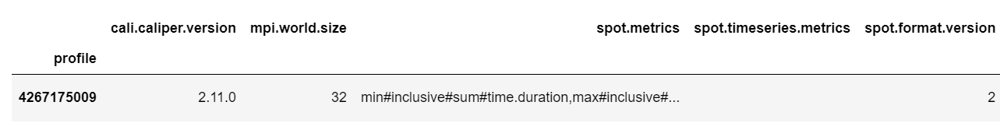
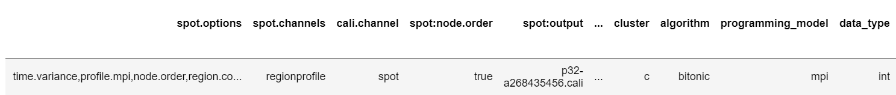
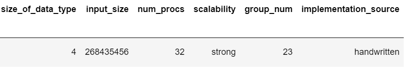

#### Merge Sort Metadata:
Columns:
```
Index(['cali.caliper.version', 'mpi.world.size', 'spot.metrics',
       'spot.timeseries.metrics', 'spot.format.version', 'spot.options',
       'spot.channels', 'cali.channel', 'spot:node.order', 'spot:output',
       'spot:profile.mpi', 'spot:region.count', 'spot:time.exclusive',
       'spot:time.variance', 'launchdate', 'libraries', 'cmdline', 'cluster',
       'algorithm', 'programming_model', 'data_type', 'size_of_data_type',
       'input_size', 'num_procs', 'scalability', 'group_num',
       'implementation_source'],
      dtype='object')
```

Values:

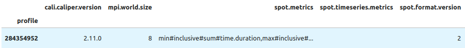
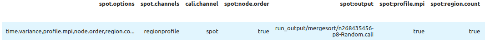
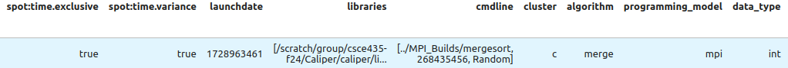
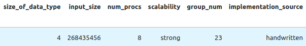

#### Radix Sort Metadata:
```
# Metadata Columns
Index(['cali.caliper.version', 'mpi.world.size', 'spot.metrics',
       'spot.timeseries.metrics', 'spot.format.version', 'spot.options',
       'spot.channels', 'cali.channel', 'spot:node.order', 'spot:output',
       'spot:profile.mpi', 'spot:region.count', 'spot:time.exclusive',
       'spot:time.variance', 'launchdate', 'libraries', 'cmdline', 'cluster',
       'algorithm', 'programming_model', 'data_type', 'size_of_data_type',
       'input_size', 'input_type', 'num_procs', 'scalability', 'group_num',
       'implementation_source'],
      dtype='object')
```
#### Metadata
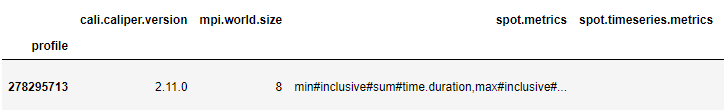
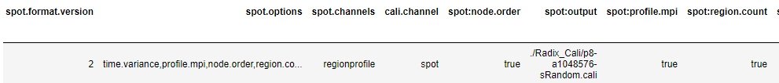
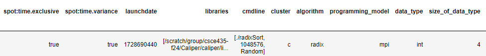
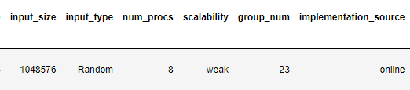
### **See the `Builds/` directory to find the correct Caliper configurations to get the performance metrics.** They will show up in the `Thicket.dataframe` when the Caliper file is read into Thicket.
## 4. Performance evaluation

Include detailed analysis of computation performance, communication performance. 
Include figures and explanation of your analysis.

### 4a. Vary the following parameters
For input_size's:
- 2^16, 2^18, 2^20, 2^22, 2^24, 2^26, 2^28

For input_type's:
- Sorted, Random, Reverse sorted, 1%perturbed

MPI: num_procs:
- 2, 4, 8, 16, 32, 64, 128, 256, 512, 1024

This should result in 4x7x10=280 Caliper files for your MPI experiments.

### 4b. Hints for performance analysis

To automate running a set of experiments, parameterize your program.

- input_type: "Sorted" could generate a sorted input to pass into your algorithms
- algorithm: You can have a switch statement that calls the different algorithms and sets the Adiak variables accordingly
- num_procs: How many MPI ranks you are using

When your program works with these parameters, you can write a shell script 
that will run a for loop over the parameters above (e.g., on 64 processors, 
perform runs that invoke algorithm2 for Sorted, ReverseSorted, and Random data).  

### 4c. You should measure the following performance metrics
- `Time`
    - Min time/rank
    - Max time/rank
    - Avg time/rank
    - Total time
    - Variance time/rank


## 5. Presentation
Plots for the presentation should be as follows:
- For each implementation:
    - For each of comp_large, comm, and main:
        - Strong scaling plots for each input_size with lines for input_type (7 plots - 4 lines each)
        - Strong scaling speedup plot for each input_type (4 plots)
        - Weak scaling plots for each input_type (4 plots)

Analyze these plots and choose a subset to present and explain in your presentation.

## 6. Final Report
Submit a zip named `TeamX.zip` where `X` is your team number. The zip should contain the following files:
- Algorithms: Directory of source code of your algorithms.
- Data: All `.cali` files used to generate the plots seperated by algorithm/implementation.
- Jupyter notebook: The Jupyter notebook(s) used to generate the plots for the report.
- Report.md
